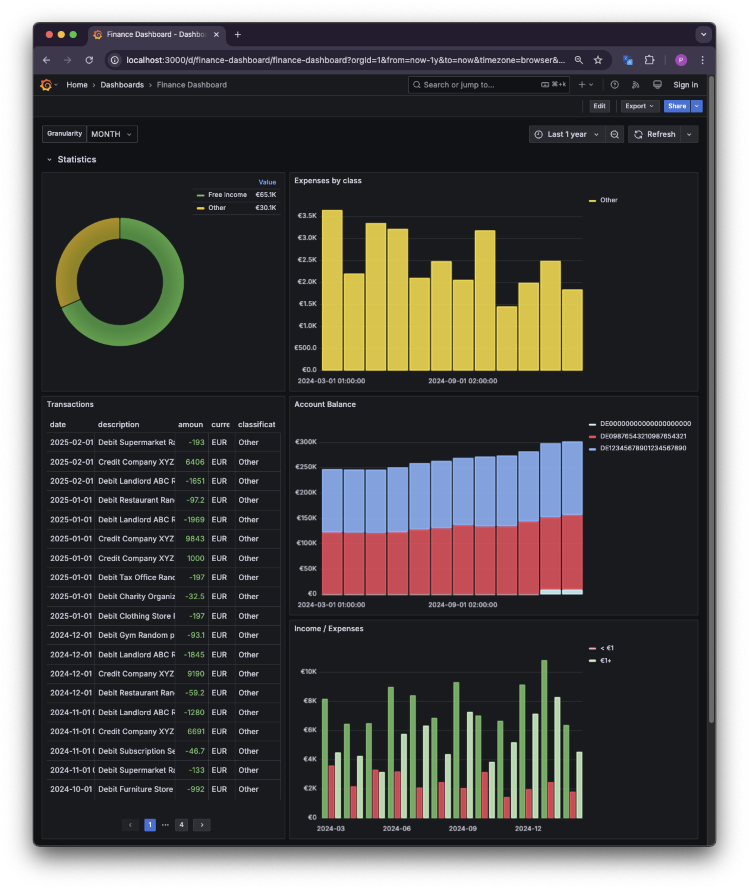
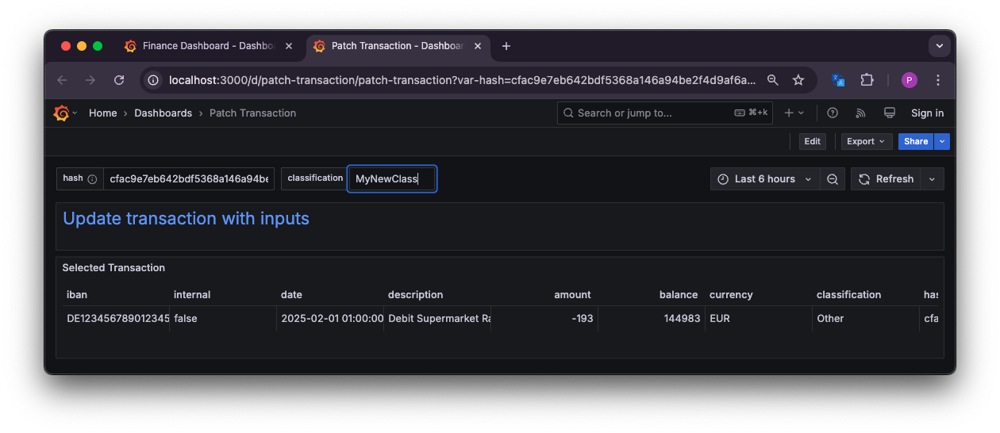
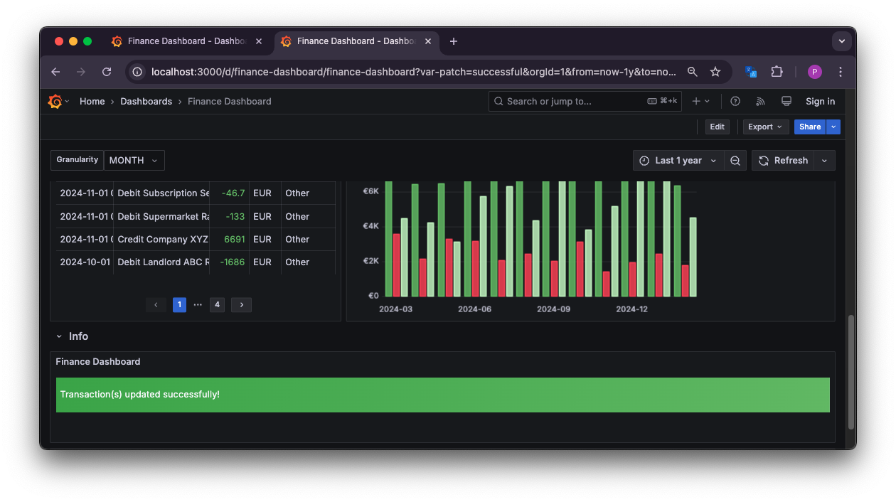

# Finance dashboard

Tool to analyze income and expenses, similar to apps like Finanzguru.



Has four parts:
- Grafana dashboard that shows the data
- Postgres database as data source for Grafana
- Syncer script that imports data from a bank account
- Patcher service that is accessed by links in Grafana to update transactions if needed

Currently the following banks are supported:
- ING (DE)

## Quickstart

```bash
docker-compose up
```

Then visit [http://localhost:3000](http://localhost:3000). You will find a Grafana dashboard with some example data.

## Loading in your own data

Make sure to have a fresh database. It's easiest to remove the complete deployment and start over:

```bash
docker-compose down -v
```

Now you need two things:
- A banking data importer plugin: see the example importer in `plugins/example_importer`
- A classifier plugin: see the example classifier in `plugins/example_classifier`

For a real-world example, see the ING DE PDF importer in `plugins/ing_pdf_de_importer`. This plugin uses depot and account statement PDFs downloaded from the ING banking dashboard. You can also provide transactions by hand through the JSON importer plugin in `plugins/json_importer`, or adapt this plugin to fit your needs.

> [!TIP]
> You can provide an `additional-requirements.txt` in the plugins directory to install additional dependencies that your plugin may need.

When you have your plugin(s), set the environment variables `IMPORTER_PLUGINS` and `CLASSIFIER_PLUGIN` to the Python path of the plugin. Then start the deployment. Use the `--build` flag to rebuild the plugins if you made changes.

```bash
export IMPORTER_PLUGINS="plugins.example_importer.importer,plugins.json_importer.importer"
export CLASSIFIER_PLUGIN="plugins.example_classifier.classifier"
docker-compose up --build
```

## Patching transactions

Sometimes transactions may not be classified correctly. For this case you can click the `Change classification` link in the dashboard. This will open a separate dashboard where you can insert your custom classification:



When clicking on the link in the dashboard, a local patcher service will be called that patches this transaction in the database and create a patch json file in `patcher/patches/`. In the dashboard you should see an alert noting that the transaction has been patched.



If you've reset the database, you can reapply these manual changes in Grafana. You'll find a `Click here to apply patched transactions` link in the dashboard. This will replay all patches in the `patcher/patches/` directory.

## License

`MIT`
